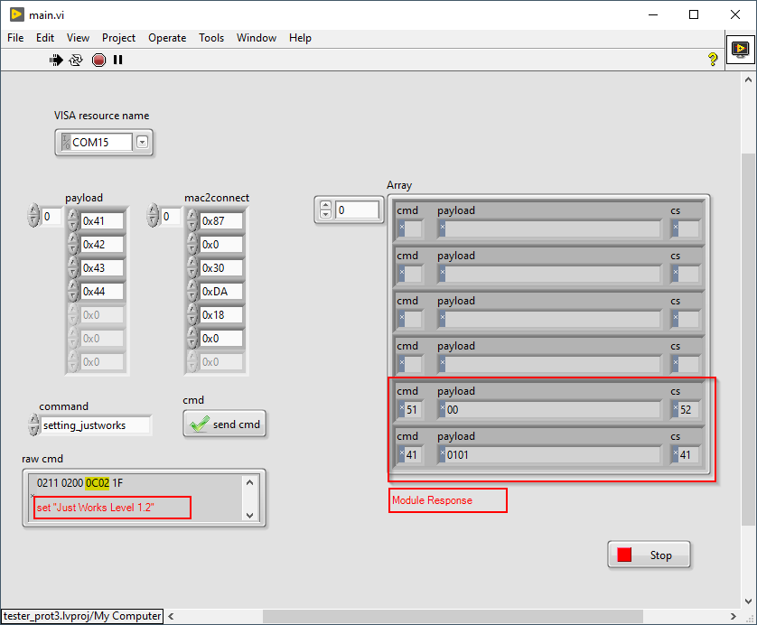
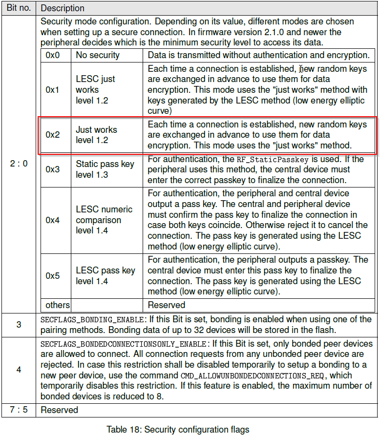
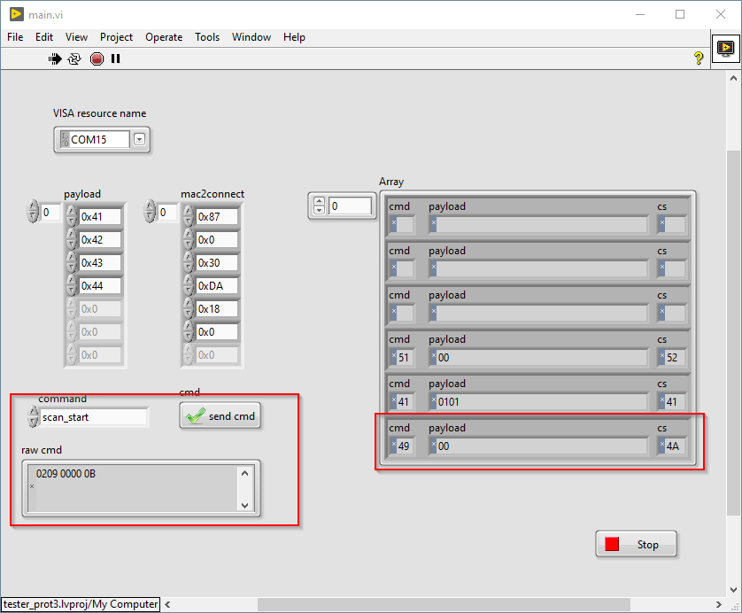
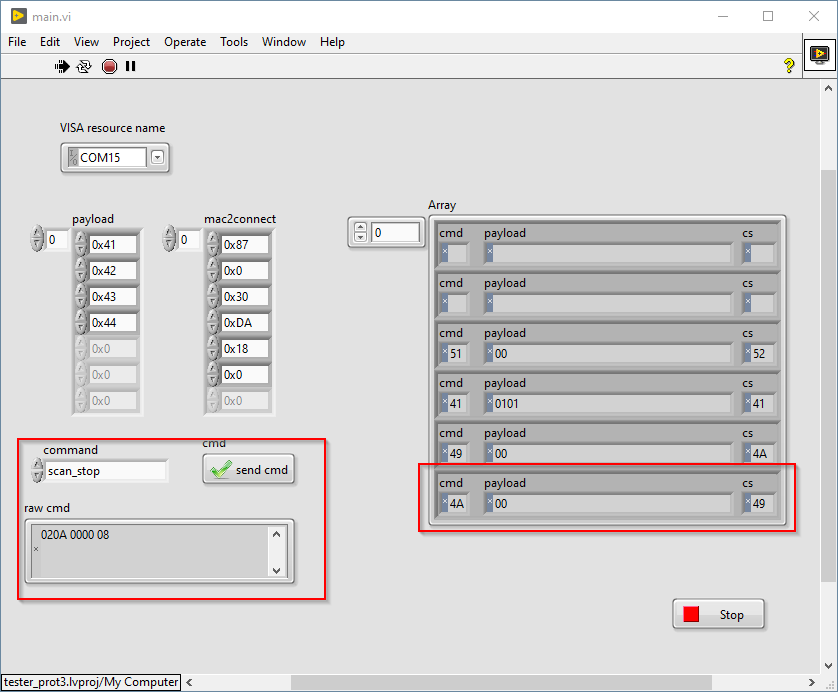
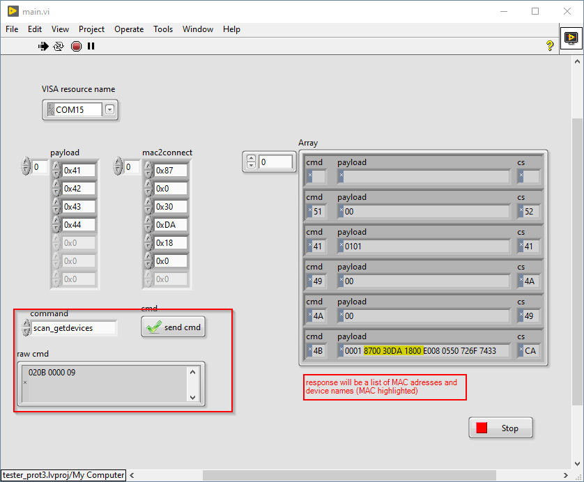
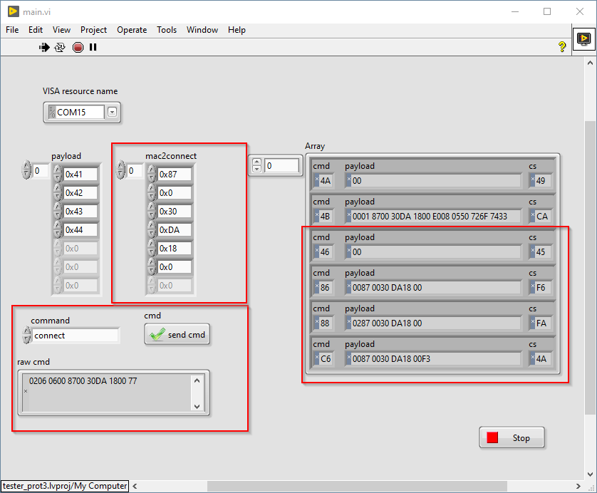
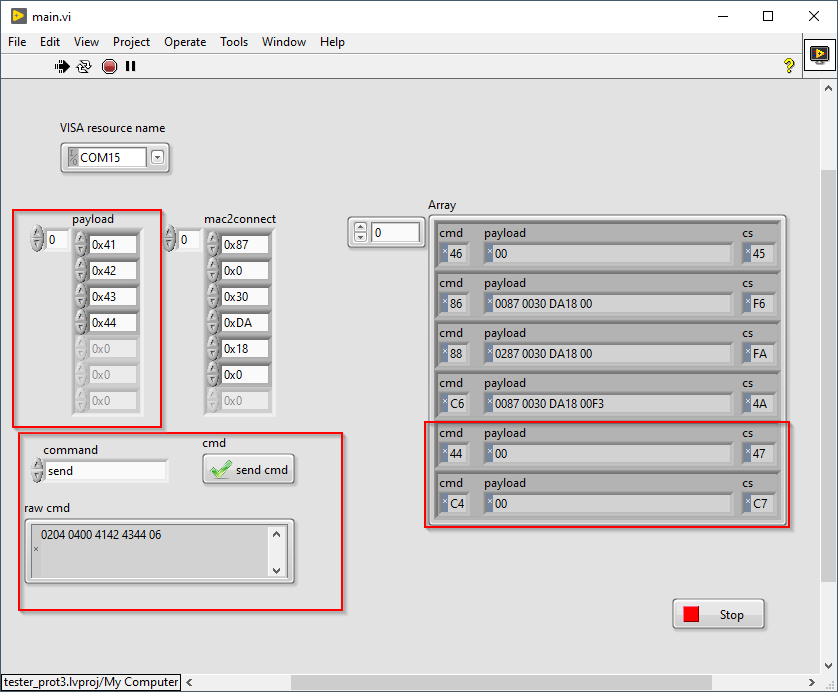
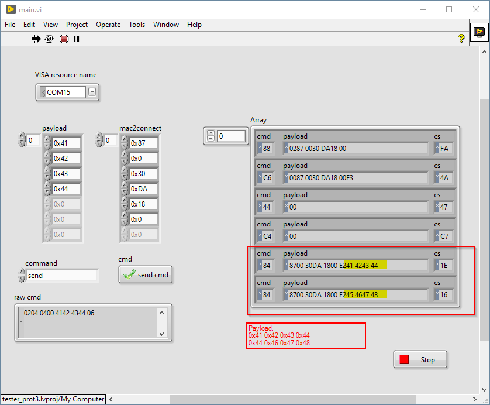
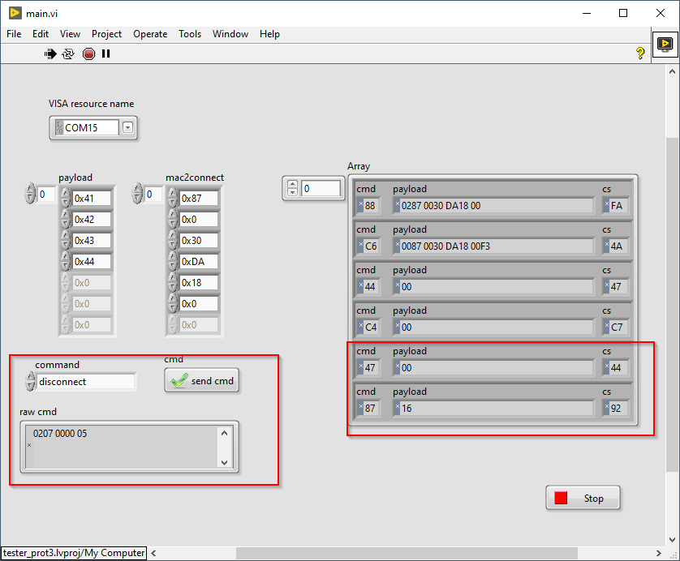

# Test setup Proteus 3 Modules

# Config

- Connect both Proteus 3 Modules 
- Chose COM Port
- Start Labview TestTool
- Configure Module to "Just Works Level 1.2"

This configures Module to  "Just Works Level 1.2" as shown in the Datasheet below

## scan

Scan for available devices with following steps

- scan start
- scan stop
- scan getdevices

## connect/tx/rx/disconnect

Execute following steps

- connect 
- send data
- (receive data)
- disconnect

Limitation; the module multiple connections at the same time. But it will be possible to control multiple modules at the same time.

